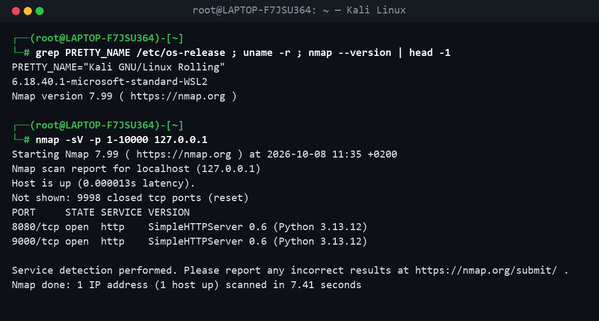
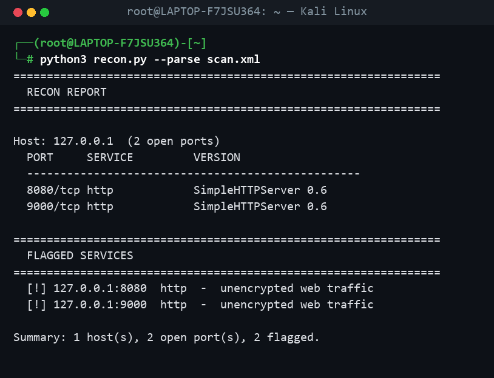

# Kali Recon Toolkit


A small, white-hat reconnaissance helper for Kali Linux. It wraps **Nmap**, saves
the scan as XML, parses it into a clean report, and flags services worth a second
look (clear-text protocols, exposed databases, remote access). Built to practise
recon on hosts I own.

> **Ethical use only.** Scan `localhost` or machines you own / are explicitly
> authorised to test. Unauthorised scanning is illegal.

## What it does

1. **Host discovery** - `nmap -sn` to see what's up.
2. **Service scan** - `nmap -sV` for open ports and version info.
3. **Report** - parses the Nmap XML and prints open ports per host.
4. **Flagging** - highlights risky services and why they matter.

## Demo (real Kali session)

Running the toolkit against a local target in Kali:





## Run it

On Kali (or any Linux with `nmap`):

```bash
sudo apt install -y nmap        # if not already installed
python3 recon.py 127.0.0.1                 # scan your own machine
python3 recon.py 192.168.56.10 -p 1-1024   # a lab host you own
python3 recon.py --parse samples/scan.xml  # just parse an existing Nmap XML
# or the all-in-one wrapper:
./recon.sh 127.0.0.1
```

A safe public target to practise on is **`scanme.nmap.org`**, which the Nmap
project provides explicitly for testing.

## What it flags

| Service | Why it's flagged |
|---|---|
| ftp / telnet | clear-text credentials on the wire |
| http | unencrypted web traffic |
| smb / netbios | common lateral-movement target |
| rdp / vnc | remote access, brute-force target |
| mysql / mssql / postgres | database exposed to the network |

Full list and logic: [`recon.py`](recon.py).

## Project structure

```
recon.py            Nmap wrapper + XML parser + report (stdlib only)
recon.sh            host discovery + scan + report in one step
samples/scan.xml    a sample Nmap XML so the parser runs without a scan
docs/screenshots/   real Kali terminal captures
```

## What I learned

- Driving **Nmap** from a script and saving machine-readable XML (`-oX`).
- Parsing that XML and turning raw ports into a prioritised, readable report.
- Which services matter in recon and why (clear-text, exposure, remote access).
- Doing all of it on **Kali Linux**, the right way - only against hosts I own.

---

Made by **Talha Aker**.
